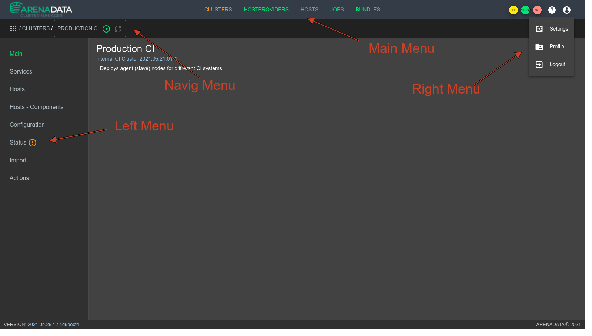
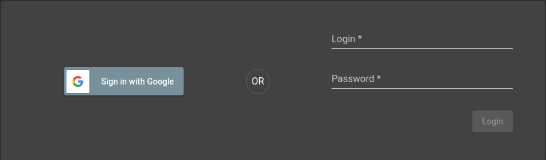
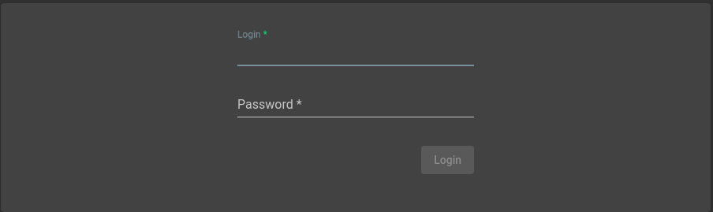

Visual parts
############

Templates
=========

There are a number of different templates for different pages in ADCM. Check them all here:

Common
------

Main template of the application is the following:

Template parts are:

* Main Menu
* Navigation Menu
* Right Menu
* Left Menu

.. note::
   TODO: We need to provide more information about parts.

Table View
----------

.. note::
   TODO: Describe table view here

Forms
=====

.. _ui_elements_forms_login:

Login Form
----------

There are two variants of login form.

First is able to login over Google GAuth2.

Second allows to login with user/password only.

Input fields:

* **Login** - is an input to pass a username
* **Password** - is an input to pass a password. This field is protected and show no password actually.

Buttons:

* **Sign in with Google** - is a button that triggers GAuth2 login process
* **Login** - is a button which that triggers user/password login process

Create cluster
--------------

Upload Bundle
-------------
