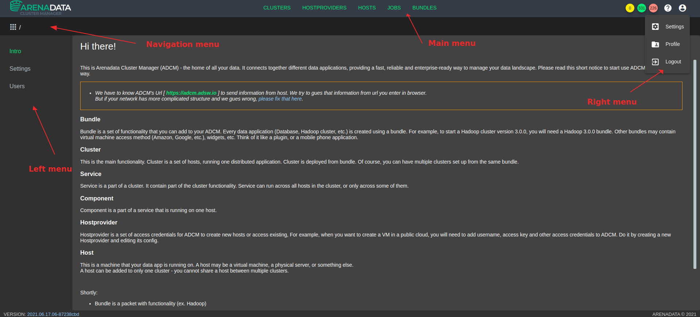
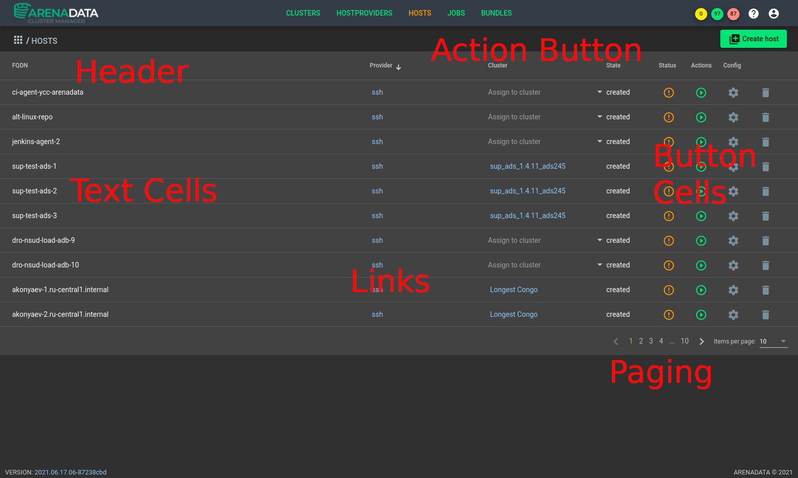
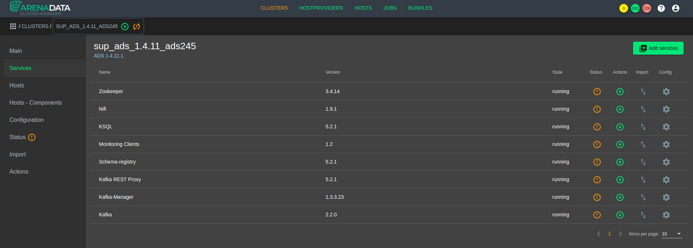
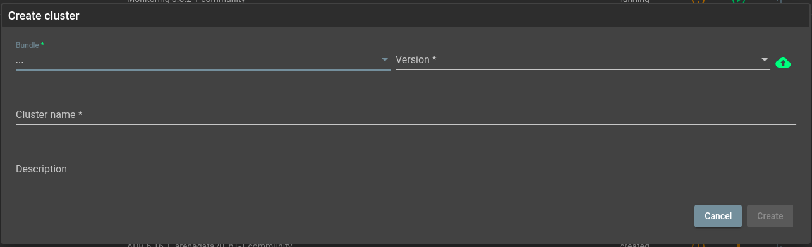

############
Visual parts
############

*********
Templates
*********

There are a number of different templates for different pages in ADCM. Check them all here:

.. _ui_templates_common:

Common
======

Main template of the application is the following:

Template parts are:

* Main Menu - contains the following sections of ADCM:
* Navigation Menu - displays decomposition to active/current section.
* Right Menu - pop-up window when selecting sections such as "Reference section", "User section". 
* Left Menu - contains the main sections when selecting a specific object (cluster, hostprovider, hosts etc)

.. note::
   TODO: We need to provide more information about parts.

Main Menu
---------

Main menu consist of the following elements:

 * CLUSTERS - link to :ref:`ui_templates_cluster_list_view`:
 * HOSTPROVIDERS
 * HOSTS
 * JOBS
 * BUNDLES
 * Job states (three circle in the right corner) - displays information about the number of jobs in the process, success jobs, failed jobs.
 * Reference section - displays information about "Ask for help" and documentation.
 * User section - contains user profile settings, settings for working in ADCM, logout functionality from ADCM.

.. _ui_templates_table_view:

Table View
==========

Table view is one of the main view of ADCM, which comes from adwp_ui. Table view is a container inside :ref:`ui_templates_common`.

As example of the table view take a look at cluster list view:

Table could be in a nested containers two. For example we could see a table in object details view:

Templates parts are:

* **Headers** - just a table headers
* **Text Cells** - an information in text form. In some cases it could be sorted.
* **Button Cells** - an action items in form of various icons.
* **Action Button** - an item related to some action typicly related to a new object creation.
* **Links** - an element, which is responsible for jumping to related object.

Clusters
========

.. _ui_templates_cluster_list_view:

Cluster List View
-----------------

Cluster List View is a view based on :ref:`ui_templates_table_view`

"CLUSTERS" element in Navigation Menu marked as selected.

Template parts are:

* Navigation Menu with an indication of the decomposition to the selected section.
* Button "Create cluster" - allows you to create a cluster.
* Tabular section which includes the following fields:
 * **Name** - contains information about the name of the cluster (sorting supported).
 * **Bundle** - contains information about the name of the :term:`Bundle` on the basis of which the cluster was added (sorting supported).
 * **Description** - contains additional information. Filled when adding a cluster.
 * **State** - contains information about the current state of the cluster (sorting supported).
 * **Status** - contains information about the current status of the cluster (sorting supported).
 * **Actions** - provides a choice of what action to perform on the cluster (install, start, stop).
 * **Import** - ???
 * **Upgrade** - allows to update the selected cluster.
 * **Config** - allows to go to the settings of the selected cluster.
* List of added clusters with information according to table fields.
* Button to delete an entry from the list of clusters
* Pagination of the list of clusters
       
.. _ui_templates_cluster-services:
       
Сluster services
------

The list of cluster services looks like this:

Template parts are:

* Navigation Menu with an indication of the decomposition to the selected section, actions that can be performed on the cluster (start, stop, install, update).
* Cluster name information and link to cluster bundle.
* Button "Add services" - allows you to add services to the cluster.
* Left menu with the following sections (active partition is highlighted):
 * **Main**
 * **Services**
 * **Hosts**
 * **Host - Components**
 * **Configuration**
 * **Status**
 * **Import**
 * **Actions**
* Tabular section which includes the following fields:
 * **Name** - contains information about the name of the service (sorting supported).
 * **Version** - contains information about the version of the service.
 * **State** - contains information about the current state of the service (sorting supported).
 * **Status** - contains information about the current status of the service (sorting supported).
 * **Actions** - provides a choice of what action to perform on the service (check, expand, restart, shrink, start, stop).
 * **Import** - ???
 * **Config** - allows to go to the settings of the selected service.
* List of added services with information according to table fields.
* Pagination of the list of clusters

*****
Forms
*****

.. _ui_elements_forms_login:

Login
=====

There are two variants of login form.

First is able to login over Google GAuth2.

.. image:: img/form_login_full.png

Second allows to login with user/password only.

.. image:: img/form_login_short.png

Input fields:

* **Login** - is an input to pass a username
* **Password** - is an input to pass a password. This field is protected and show no password actually.

Buttons:

* **Sign in with Google** - is a button that triggers GAuth2 login process
* **Login** - is a button which that triggers user/password login process

.. _ui_form_dialogs_common:

Operation dialog
================

All operation dialogs has the same unified look:

Elements of the dialog:

* **Title** - this is the top of the dialog text which is the same as a on button clicked to call this dialog
* **Form Inputs** - there are a number of input fields which is required for action to proceed. Fields can be mandatory.
* **Cancel Button** - Just a "Cancel" which is the same on dialog. You could click on it to close the dialog without any operation happend.
* **Positive Button** - A button which triiger the operation (use case** for this dialog. The caption of this button has some variation in different dialogs.

.. _ui_form_dialogs_create_cluster:

Create Cluster Dialog
---------------------

This a subset of :ref:`ui_form_dialogs_common` with the following options:

============== ===============
Title          Positive Button
============== ===============
Create cluster Create
============== ===============

============== ========= ========== ======================================
Input Name     Mandatory Type       Meaning
============== ========= ========== ======================================
Bundle         True      Drop Down  A list of cluster bundles uploaded to ADCM
Version        True      Drop Down  A list of versions for selected bundle
Cluster name   True      String     A short name of future cluster to be identified by user
Description    False     String     Any additional information provided by user.
============== ========= ========== ======================================

.. _ui_form_dialogs_create_hostprovider:

Create Host Provider Dialog
---------------------

This a subset of :ref:`ui_form_dialogs_common` with the following options:

=============== ===============
Title           Positive Button
=============== ===============
Create provider Create
=============== ===============

================== ========= ========== ======================================
Input Name         Mandatory Type       Meaning
================== ========= ========== ======================================
Bundle             True      Drop Down  A list of Host Provider bundles uploaded to ADCM
Version            True      Drop Down  A list of versions for selected bundle
Hostprovider name  True      String     A short name of future Host Provider to be identified by user
Description        False     String     Any additional information provided by user.
================== ========= ========== ======================================

Upload Bundle
-------------
